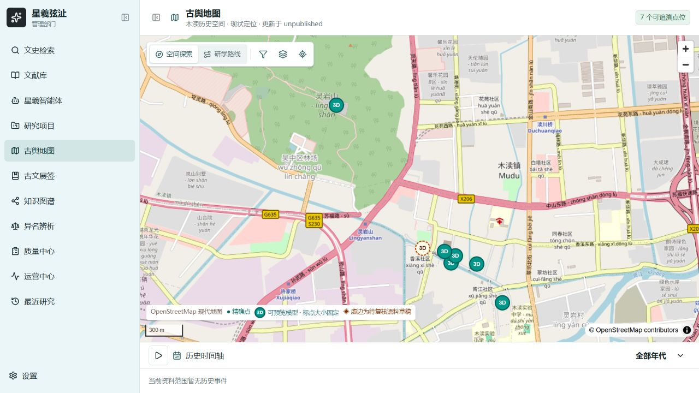

# 地图模型标点与点击预览

地图的七个现有景点已接入实际 GLB：木渎古镇、虹饮山房、古松园、榜眼府第、明月古寺、灵岩山寺、永安桥。进入 `/workspace/map`，点击“3D”圆点即可加载模型；桌面使用右侧详情栏，手机使用底部面板。支持旋转、缩放、复位、放大查看和加载失败重试。

圆点固定为 28×28 CSS 像素，点击区域为 44×44 像素；地图缩放或选中时圆点大小不变。模型参考点沿用后端已有景点坐标及来源。永安桥仍为近似定位，圆点使用浅色虚边。名称按悬停、聚焦、选中或缩放等级显示。

## 数据与资源

- `frontend/src/core/map/model-assets.ts` 精确绑定 reference 点位 ID 与实体 ID；不按名字或实体回退绑定语料点。
- `/api/map/reference-points` 单独提供后端已有 reference 景点，前端只补充实际模型对应的景点。不改变正式知识目录、发布状态或快照，正式目录失败仍显示错误。
- 七个实际 GLB 位于 `frontend/public/models/` 的内容摘要版本地址，合计约 399.52 MiB。进入地图和缩放不下载模型，选中模型页签后才加载；切换、关闭卸载，只保留一个活跃查看器，放大复用同一实例。
- 模型为照片生成示意，不代表完整景区或实测复原。界面保留对象范围、生成示意、原定位可信度、来源与许可待确认说明。尚未制作移动端轻量版，加载统计尚未接入运营后台。

## 本地验证

- 初次模型接入：29 项前端地图单元测试、12 项浏览器测试通过，七个真实 GLB 加载及交互验证通过。
- 固定标点更新：33 项前端地图单元测试、12 项后端地图测试、9 项浏览器回归通过；在五次缩放和选中后实测圆点仍为 28×28，点击区域仍为 44×44。
- 前端完整规范/类型检查、构建及后端修改文件规范检查通过。真实登录地图可显示七个模型参考点。
- 完整后端测试在修改前后均有 12 项既有模块缺失收集错误，主要涉及 `deerflow.skills.skillscan.orchestrator`；未声称后端全量通过。
- 最新 `main` 整合后：33 项前端地图单元测试、12 项后端地图测试、完整前端规范/类型检查、后端修改文件规范检查及 Webpack 构建通过。十个浏览器场景最终均通过，其中一个点击时序用例修正后单独重跑通过。临时中文路径触发默认 Turbopack 内部 Unicode 错误，使用 `next build --webpack` 验证构建。

功能分支基于协作仓库最新 `main`，整合后的检查结果在 README 迭代日志记录。此次分支提交不等于线上部署。
