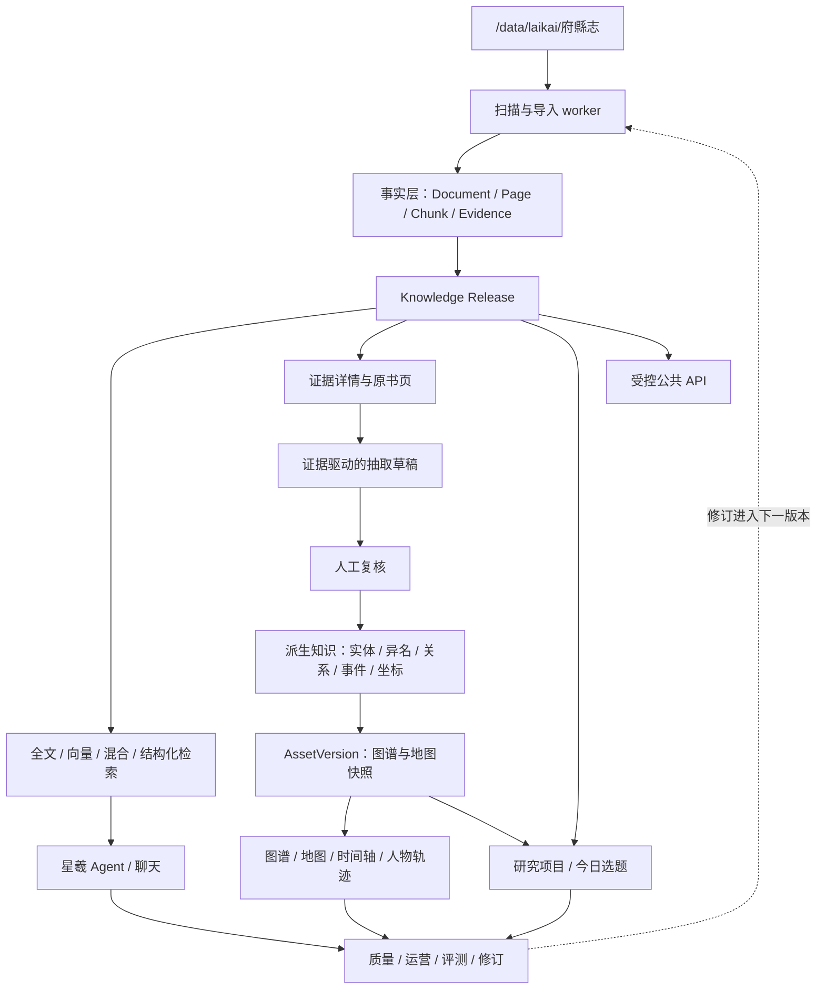

# 府县志语料接入星羲弦沚实施计划

- 制定日期：2026-08-21
- 最近更新：2026-08-25（74/74 真实导入完成；内部工作版、全文索引、持久 Evidence、真实 Agent 引用与 Evidence 驱动派生知识可视化已实现）
- 数据位置：`/data/laikai/府縣志`
- 项目位置：`/data/laikai/deer-flow`
- 当前状态：全量只读扫描与 74/74 个书包真实幂等导入已完成；服务器内部工作版 `release-2c7aafe43b4247fa86ab0d6b951590e7` 已激活，78,930 个 Chunk 的全文索引与 Evidence 已就绪。首批 Evidence 绑定的 16 个实体、13 条关系、9 个事件、5 个 GeoFeature 已形成幂等 `pending` 种子，图谱人物关系、事件时间轴、地图草稿层和动态人物轨迹均已实现；这些派生记录仍须人工复核后才能成为正式知识。

### 0.1 派生知识可视化落地

- `backend/data/fuxianzhi_knowledge_seed.json` 保存可回查原文的首批结构化草稿，不包含无 Evidence 的断言。
- `bootstrap_fuxianzhi_knowledge.py` 校验 Evidence 属于 Active Release，重复运行只更新仍为 `pending` 的同 ID 草稿，不覆盖人工审核结果。
- 知识图谱支持全部关系/人物关系切换、审核状态筛选、事件时间轴、Evidence 深链和地图入口。
- 地图把静态公开参照、已复核 SQL 记录和待复核语料草稿分层；人物轨迹由事件参与者及人物—地点关系动态生成。
- 轨迹虚线仅表达证据节点的时间顺序，`approximate/speculative` 坐标和 `pending/disputed` 状态始终可见，不得解释为真实道路或已确认史实。

## 1. 目标

把服务器现有府县志资料接入星羲弦沚已有的史料链路，最终形成：

1. 可追溯的 `SourceDocument` 与 `SourceFile`；
2. 保留原始扫描件、原始 OCR、清洗文本和页码对应关系；
3. 可恢复、可重试、可审计的批量入库任务；
4. 经人工复核后发布的不可变 `Knowledge Release`；
5. 可供全文、向量和混合检索使用，并能在 Agent 回答中给出准确出处；
6. 原始资料不被移动、不被覆盖，也不进入 Mutagen 同步目录。

本计划先完成两部书的真实闭环，再按地区和规模逐批扩展到全部资料。

## 2. 已确认的数据基线

### 2.1 数据规模

对 `/data/laikai/府縣志` 的只读盘点结果如下：

| 项目 | 结果 |
| --- | ---: |
| 总体积 | 约 24 GiB（25,680,537,724 bytes） |
| 数字书包 | 74 个 |
| 文件 | 518 个 |
| 目录 | 80 个 |
| PDF | 74 个，共 25,140,938,920 bytes |
| TXT | 296 个，共 353,740,991 bytes |
| HTML | 148 个，共 185,857,813 bytes |
| 页标记 | 120,815 页 |
| 超过现有 50 MiB 上传上限的 PDF | 59 个 |
| 最大 PDF | 2,210,943,705 bytes |

地区体积：

| 地区 | 体积 |
| --- | ---: |
| 苏州 | 约 16 GiB |
| 常熟 | 约 3.7 GiB |
| 吴江 | 约 1.8 GiB |
| 太仓 | 约 1.4 GiB |
| 昆山 | 约 1.4 GiB |
| 包山集四卷 | 约 66 MiB |

### 2.2 每个数字书包的固定结构

74 个书包均完整包含以下 7 个文件，没有缺件：

```text
<地区>/<书名或版本>/
├── book.pdf
├── text_raw_简体.txt
├── text_raw_繁体.txt
├── text_简体.html
├── text_简体.txt
├── text_繁体.html
└── text_繁体.txt
```

四个 TXT 版本在每部书中的页数一致，物理页序号连续。TXT 采用如下页标记：

```text
===== 第 13 页 (folio 13) =====
```

其中有 757 个页标记的物理页号与 `folio` 不相同，因此导入时必须同时保存物理 PDF 页号和原书叶码，不能只保留一个数字。

### 2.3 数据质量事实

- 所有 TXT/HTML 均可按 UTF-8 严格解码，没有真实解码失败。
- `太仓/（咸丰）壬癸志稿` 的 6 个文本文件被系统 `file` 命令误判为二进制，但 UTF-8 校验通过且不存在 NUL 字节；导入不能只依赖 MIME 猜测。
- 原始繁体文本中发现 1,082 个残留行首 `b`；清洗繁体文本仍有 126 个。
- 清洗繁体文本中仍有 1,237 个缺字占位符 `□`。
- 简体文本中发现 10 个 Unicode 替换字符 `�`，繁体文本未发现该字符。
- 抽样 PDF 为纯扫描影像，没有可直接提取的文本层。
- 配套 HTML 只是分页展示文件，不应作为第三份独立证据正文入库。
- 目录目前所有者为 `zxfan`，权限接近全员可写。共享服务器上存在误改、误删风险，正式导入前必须由所有者或管理员确认并收紧权限。

## 3. 项目当前基线与差距

### 3.1 已有能力

项目已经具备以下领域对象和管理链路：

```text
SourceDocument
  -> SourceFile
  -> ParsedDocument / OCR Page
  -> CleanedOcrPage
  -> ChunkSet
  -> ReviewRecord
  -> KnowledgeRelease
  -> Full-text / Vector / Hybrid Search
  -> Evidence / Citation / Agent Answer
```

已有代码覆盖资料登记、授权、上传、去重、解析、OCR、清洗、分块、人工复核、知识发布、全文检索、向量检索、混合检索、证据包和引用约束，应在此链路上扩展，不能另建一套孤立数据库。

### 3.2 导入前服务器运行数据（历史基线）

本节记录导入前的历史基线；当前实机状态见 7.10。导入前 SQLite 数据库约 148 MiB，只读统计显示：

- `wu_source_documents`：2 条；
- `wu_source_files`：3 条；
- `wu_ingestion_jobs`：1 条，仍停在 `pending / parse / 0%`；
- OCR、清洗页、ChunkSet、知识发布、全文索引和向量索引均为 0；
- 当前两条资料是内部、授权未确认的维基文库预览记录。

新导入必须使用新的稳定 ID 和导入批次，不能覆盖或清空这些现有记录。

### 3.3 不能直接全量上传的原因

1. 当前单文件上限是 50 MiB，59 个 PDF 超限。
2. 当前上传虽先写临时文件，但随后会把完整文件读入内存；最大 2.21 GB PDF 不可接受。
3. 本地对象存储也使用完整 `bytes` 写入，并会再复制一份 25 GB PDF。
4. 当前 TXT 解析器会把整本 TXT 当作第 1 页，无法识别数据中的页标记。
5. 当前 OCR 每批最多处理 50 页，而语料已有 120,815 页及现成 OCR；重新 OCR 成本和耗时都不合理。
6. 当前入库状态机提供状态、租约和 API，但没有常驻 worker 自动执行完整流水线。
7. 当前卷标题规则不能稳定识别 `卷之一`、`包山集卷之一` 等格式。
8. 当前数据库配置为 SQLite；全量发布、并发入库和 pgvector 应在 PostgreSQL 上完成。
9. 当前 PostgreSQL Compose 使用普通 `postgres:17-alpine`，需要改为包含 pgvector 的受控镜像并实机验证扩展。

## 4. 核心方案决策

### 4.1 不重新 OCR 全部 PDF

使用已有成果：

| 数据文件 | 接入角色 |
| --- | --- |
| `book.pdf` | 原始扫描件；只读外部资产，保留用于核对和页图展示 |
| `text_raw_繁体.txt` | 预计算的原始 OCR，作为不可变 raw 文本 |
| `text_繁体.txt` | 预计算的清洗繁体，作为引用和人工复核的规范正文 |
| `text_简体.txt` | 检索归一化辅助文本，不替代繁体引用正文 |
| `text_raw_简体.txt` | 审计/比对辅助，首期不进入正式证据正文 |
| 两个 HTML | 派生预览文件，首期只登记或忽略，不重复入索引 |

只有人工复核发现严重错误的页面，才按页调用现有 OCR Provider 重跑。

### 4.2 PDF 原地只读引用，文本进入受控存储

- Gateway 将 `/data/laikai/府縣志` 只读挂载为容器内 ASCII 路径 `/data/corpora/fuxianzhi:ro`。
- PDF 使用 `mounted_readonly` 类型的受控资产引用，不复制 25 GB，也不创建软链接或硬链接。
- 原始繁体和清洗繁体 TXT 总量不足 180 MiB，可复制到现有内容寻址对象存储，作为可复现的导入输入。
- 删除业务记录只能解除引用并写审计记录，绝不能删除挂载目录中的原始 PDF。
- 所有路径必须相对已配置的 corpus root；API 不接受任意绝对路径。

### 4.3 一部逻辑文献不一定等于一个文件夹

文件夹代表数字书包，不必然等于 `SourceDocument`。例如同一版府志的“一、二、三、四”可能应合并为一个逻辑文献、多个 `SourceFile`。必须先生成清单，再由项目方确认：

- 逻辑书名；
- 版本/年代；
- 地区；
- 分册关系；
- 来源机构与持有人；
- 来源等级；
- 版权和授权范围。

导入代码只读取清单，不以具体书名编写特殊分支。

### 4.4 未确认授权不发布

目录名称不能证明版权或授权。未完成授权字段的资料只允许登记和质量审计，不进入正式知识版本。默认值应为：

```text
authorization_status = unconfirmed
visibility_scope = internal
authorized_uses = []
```

不得自动把府志推断为 A/B 级，也不得自动授予公开全文或公开引用权限。

### 4.5 全量导入前切换 PostgreSQL

- 备份当前 SQLite 数据库及配置。
- 使用包含 PostgreSQL 17、`pg_trgm` 和 `pgvector` 的固定版本镜像。
- PostgreSQL volume 继续落在 `/data/laikai/docker` 所在大容量数据盘。
- 先迁移并核对现有用户、研究项目、2 条资料和 3 个文件，再导入新语料。
- 不允许把现有 SQLite 文件直接丢弃后重新开始。

## 5. 目标架构


## 6. 清单设计

新增清单使用 JSONL 或 YAML，保存于服务器独立运行目录，例如：

```text
/data/laikai/import-manifests/fuxianzhi-v1.jsonl
```

不要把包含版权证明路径或内部备注的真实清单同步回本地仓库。每条至少包含：

```yaml
manifest_version: fuxianzhi-v1
bundle_id: sha256-of-stable-relative-path
corpus_root_id: fuxianzhi
relative_directory: 苏州/（同治）苏州府志
logical_document_id: pending-human-review
region: 苏州
title: 苏州府志
edition: 同治
part_label: null
source_type: gazetteer
source_level: null
source_institution: null
holder: null
copyright_status: unknown
authorization_status: unconfirmed
visibility_scope: internal
authorized_uses: []
assets:
  original_pdf: book.pdf
  ocr_raw_traditional: text_raw_繁体.txt
  clean_traditional: text_繁体.txt
  clean_simplified: text_简体.txt
page_count: 13853
hashes: {}
```

扫描器只生成候选字段。`source_level`、机构、持有人、版权、授权及分册归并必须人工补齐。

## 7. 需要新增或调整的模块

### 7.1 领域层

建议新增：

```text
backend/packages/wu_culture/wu_culture/corpus_import/
├── models.py       # Manifest、批次、条目、质量报告
├── scanner.py      # 只读扫描、格式验证、流式 SHA-256
├── page_parser.py  # 页标记、folio、raw/clean 对齐
├── service.py      # 幂等导入编排，调用现有 Repository
└── cli.py          # scan / validate / import / resume / status
```

要求：

- 领域服务调用现有 Repository，不在脚本中直接拼 SQL。
- 导入按 manifest hash、bundle ID、文件 SHA-256 幂等。
- 支持 `dry-run`，默认不写数据库。
- 支持中断恢复、单书重试、按地区/书目过滤。
- 发现软链接、路径越界、导入中途文件变化时立即拒绝。

### 7.2 数据模型和迁移

使用下一个可用迁移版本新增或扩展：

1. `CorpusImportBatch`：清单哈希、状态、操作者、开始/结束时间和汇总。
2. `CorpusImportItem`：bundle、逻辑文献、各步骤状态、错误和重试次数。
3. 只读挂载资产元数据：corpus root ID、相对路径、SHA-256、大小、MIME、最近校验时间。
4. OCR provenance：允许明确记录 `precomputed_import`，置信度未知，不能伪造 bounding box、图片尺寸或模型置信度。
5. Page locator：保留 `physical_page_number` 和 `folio_label`，并向 Chunk/Citation 暴露可选 folio 范围。
6. 清洗 provenance：记录上游 raw/clean 文件哈希、导入规则版本和确定性 diff。

现有 `SourceDocument`、`SourceFile`、`CleanedOcrPage`、`ChunkSet`、`ReviewRecord` 和 `KnowledgeRelease` 仍是正式业务对象。

### 7.3 对象与资产访问

扩展现有对象访问能力，使其支持：

- 受控本地/S3 对象：现有上传继续使用；
- `mounted_readonly` 原件：只允许配置过的 corpus root；
- 流式哈希和流式读取，不返回完整 2 GB `bytes`；
- HTTP Range 读取 PDF；
- 按需渲染单页并缓存派生页图，不预生成 120,815 张图片；
- 每次关键读取前可校验 size/mtime，发布前必须复核 SHA-256。

### 7.4 页文本导入

新增专门的府县志通用页标记解析器：

1. 流式读取 UTF-8；
2. 识别 `===== 第 N 页 (folio X) =====`；
3. raw 与 clean 必须页数相同、物理页序连续；
4. 保留空白页；
5. 保存物理页号与 folio，不把页标记写入正文；
6. 繁体为证据正文，简体只进入检索归一化字段；
7. 无置信度和版面框时明确标为未知，并进入复核队列；
8. 对 `b` 前缀、`□`、`�`、异常空页、超长页和 raw/clean 差异率生成质量告警。

### 7.5 卷目切分

扩展现有切分规则并建立真实 Fixture，至少覆盖：

- `卷一`、`卷之一`、`第一卷`；
- `包山集卷之一` 等带书名标题；
- 序、目录、卷前、卷末；
- 跨页段落；
- 无标点竖排 OCR 行；
- 误含“卷”字的普通正文，防止误判。

规则变更必须产生新的 `split_version`，不得原地修改已发布 ChunkSet。

### 7.6 入库 worker

当前状态机只记录状态。需要新增常驻 worker 或受控后台服务，执行：

```text
validate manifest
  -> register source/assets
  -> import precomputed OCR
  -> import/verify clean text
  -> chunk
  -> awaiting_review
  -> review finalize
  -> full-text index
  -> optional vector index
```

要求：

- 使用现有 lease、heartbeat、并发预算和恢复 API；
- 默认并发 1，稳定后最多 2；
- 任务重启后从最后一个完成步骤继续；
- 自动发布始终关闭；
- 任务日志不写入受限全文，只记录 ID、哈希、数量、阶段和错误摘要。

### 7.7 检索与引用

- 引用展示使用清洗繁体文本，保留原始 OCR 对照入口。
- 全文索引同时覆盖规范繁体和简体检索归一化文本，但命中片段返回繁体正文。
- 向量索引在 Embedding Provider 配置并通过样本验收后再构建。
- Hybrid Search 保持单通道 fail-open：向量未就绪时全文检索仍可用。
- Citation 增加可选 folio，且可打开对应 PDF 物理页。
- 未复核、未授权或不在激活 Release 中的内容不得进入普通 Agent 的正式证据。

### 7.8 管理端

首期以 CLI 批量导入，现有文献库 UI 继续负责查看、复核和发布。之后再增加：

- corpus 批次状态与失败条目；
- 按地区、文献、质量告警筛选；
- raw/clean/PDF 页三方对照；
- 批量复核操作及明确的审核依据；
- 发布前统计：文献数、页数、Chunk 数、未审数、授权异常数。

浏览器不得允许管理员输入任意服务器绝对路径。

### 7.9 当前实现状态（2026-08-22）

已完成第一批不依赖授权结论的技术基础：

- 新增 `wu_culture.corpus_import` 领域模块；
- `scan_corpus` 只读发现七件套、流式计算 SHA-256，并生成安全默认的候选 manifest；
- 扫描会拒绝缺件、无页标记、非 UTF-8、四个 TXT 页数/页定位不一致、非连续物理页和符号链接资产；
- `parse_paginated_texts` 将 raw 繁体、clean 繁体和 clean 简体按物理页与 folio 对齐，保留空页；
- `analyze_page_quality` 可报告残留行首 `b`、`□`、`�` 和空 clean 页，不自动修改正文；
- CLI 已提供 `scan` 和 `validate`，JSONL 只保存 root ID 与相对路径，并校验重复身份、路径穿越和 bundle ID；
- 相关测试、原有文档解析测试和结构切分测试已通过；测试数据均为临时合成数据。

本批明确未包含：数据库迁移、`CorpusImportBatch`/Item Repository、mounted asset、导入 worker、真实 24 GiB 扫描、SourceDocument 写入、发布、索引和任何前端改动。下一批从 7.2 数据模型与 7.6 worker 的持久化边界开始，并继续保持自动发布关闭。

### 7.10 内部工作版与全量实机进展（2026-08-24）

7.9 记录的是首批实现时的历史状态。后续已完成：

- 新增来源等级 `U（待评定）`，不伪造 A-E 等级；
- 新增 `public | internal` Release scope；公开版保持完整复核门禁，内部版只允许 `internal_processing`；
- 新增 `--allow-unconfirmed-internal --publish-working-release`，可增量导入、失败后复用已完成书包，并创建/复用、激活和索引一个内部工作版；
- 全文索引同步持久化 `wu_evidence`，让 Agent 引用可以打开真实 Evidence 详情；
- 普通知识检索 API、Agent 工具和 Run 元数据均按服务器解析出的 Release scope 选择授权用途；
- 地图目录可合并 active Release 下已复核、有 Evidence、有坐标依据的 SQL 实体、GeoFeature 和事件；
- 修复清洗文本插入片段与 raw span 无重叠时的分块回退，改用实际来源 OCR 页，避免大规模导入失败；
- 服务器已逐书完成 74/74 个书包、120,815 页的真实导入，并于 2026-08-24 完成统一内部 Release 与索引验收。

服务器实机验收结果：

| 项目 | 结果 |
| --- | --- |
| Active Release | `release-2c7aafe43b4247fa86ab0d6b951590e7`，`v1`，scope=`internal`，state version=`1` |
| Release manifest | `c1e91f5cfb8a40a4c64258dbeefed63c2902d599478c1bd401cedbb6321afdba` |
| Release 内容 | 74 Documents、74 SourceFiles、74 ChunkSets、78,930 Release Items |
| 全文索引 | `ready`，78,930 Documents，覆盖 74 部书 |
| Evidence | 78,930 条，全部可由全文命中稳定定位 |
| Agent 运行元数据 | 已解析 `knowledge_release_scope=internal`，同时固定 Release ID、version 和 manifest hash |
| 真实检索 | 简体查询“木渎”命中 742 个 Chunk；真实 HTTP Agent Run 调用 `search_sources(query="木渎镇", top_k=3)`，返回 3 条真实 Evidence，状态为 `inferred` |
| 引用深链 | Agent 最终回答包含对应的 3 个 `evidence://fulltext-release-...` URI；内部 Evidence 接口均返回 200，可打开《乾隆吴县志》《嘉靖吴邑志》《民国宋平江城坊考》的物理页与繁体原文；公共接口仍受 `public_quote` 门禁 |
| 地图目录 | 9 个可追溯现状点、2 条研学路线、5 个历史事件、1 条人物活动轨迹；实时道路规划实测返回 `routed` 与 8 个路线坐标。当前没有已复核的府县志 Entity/GeoFeature/Event，因此没有伪造 corpus 地图点 |
| 向量通道 | Embedding 未配置，混合检索明确标记 `degraded`，全文通道正常服务 |
| SQLite | 主库约 2.4 GiB；发布完成后已执行 WAL checkpoint，临时 WAL 从约 1.3 GiB 截断为 0 |

全量发布及真实 Agent 验收期间修复了只在真实规模与完整运行链暴露的问题：完成书包在 CLI 中直接复用持久 `chunk_set_id`；内部 Release 不再对 78,930 个 Chunk 执行无意义的逐页复核查询；Release 主记录先 flush 再批量写 Item，满足 SQLite 外键顺序；ToolNode 能从同步工具签名识别并注入 `ToolRuntime`；structured/hybrid 超时后直接回退全文检索且不重复请求 hybrid；模型传入空字符串 cursor 时按未分页处理。检索层同时支持简繁双向查询扩展，正文继续以繁体返回。

内部工作版只解决开发期“全部文本可被 RAG 使用”的问题，不代表资料已公开授权，也不代表书中所有地点已经有可显示的地图坐标。

## 8. 各业务模块如何使用府县志数据

本节描述资料完成登记、复核和发布后，现有业务模块如何消费它们。它是目标实现方案，不表示这些模块目前已经全部接通。

### 8.1 统一消费边界

除 Corpus Scanner、导入 worker 和受控原件读取器外，任何页面、Agent 工具或定时任务都不得直接遍历或读取 `/data/laikai/府縣志`。业务模块只通过数据库、索引和 Evidence API 使用数据。

数据分为三层：

| 层级 | 核心对象 | 数据性质 | 写入规则 |
| --- | --- | --- | --- |
| 事实层 | `SourceDocument`、`SourceFile`、页、`ChunkSet`、`Chunk`、`Evidence`、`KnowledgeRelease` | 可回到原书页的直接文献事实 | 只由入库、清洗、分块、复核和发布链路写入 |
| 派生知识层 | `Entity`、Alias、Relation、Event、`GeoFeature` | 从文献事实中抽取、归并或判断得到的知识 | 必须保存 `evidence_ids`、复核状态和版本归属；自动抽取只能生成草稿 |
| 应用与运营层 | 研究项目、今日选题、用户反馈、修订单、评测结果、索引状态 | 用户工作记录和系统运行数据 | 只保存对象 ID、版本 ID、查询和必要摘要，不复制一套文献正文 |

统一依赖关系如下：



`KnowledgeRelease` 当前只冻结 Chunk 清单；图谱和地图还需要使用现有 `AssetVersion` 思路形成与该 Release 对应的不可变快照。一次可复现的运行上下文至少包含：

```text
knowledge_release_id
knowledge_release_manifest_sha256
asset_version_id
graph_manifest_sha256
map_manifest_sha256
```

文本检索和 Evidence 按 `knowledge_release_id` 读取，图谱、时间轴和地图按该 Release 对应的 `asset_version_id` 读取。Gateway 创建新会话时固定这组上下文；会话运行中即使管理员切换 active Release，也不能混入新版本数据。

### 8.2 跨模块关联键

| 关联键 | 含义 | 使用约束 |
| --- | --- | --- |
| `release_id` | 一次不可变的正式文献发布 | 普通读取默认解析 active Release；历史回放和管理员验收可显式指定 |
| `document_id` | 一部逻辑文献 | 分册可共享一个 `document_id`，研究项目也以此关联文献 |
| `source_file_id` | 一册或一种受控文件资产 | 用于定位 PDF、OCR 和清洗页，不向浏览器暴露服务器绝对路径 |
| `chunk_id` | 某个 `split_version` 下的稳定文本片段 | 搜索命中、图谱抽取和项目摘录都必须保留它 |
| `evidence_id` | 可引用的证据定位器 | 连接 Chunk、文献、页码、folio、原文和派生知识，是跨模块最重要的事实指针 |
| `entity_id` | 人、地、机构、物等规范实体 | 异名、关系、事件、地图点和人物轨迹共享，不用名称字符串做外键 |
| `asset_version_id` | 某个 Release 对应的图谱/地图快照 | 防止同一文本版本在不同时间返回不同的派生知识 |

所有模块共同遵守以下规则：

1. 普通用户只能消费已复核、已授权且属于当前运行上下文的内容。
2. API 响应和运行日志必须携带实际解析到的 `release_id`；涉及图谱或地图时还要携带 `asset_version_id`。
3. `release_id IS NULL` 不能继续作为普通派生数据的默认发布方式。若确有跨版本全局数据，必须单列为经过审核的 `global_curated` 数据集，并显式合并。
4. 自动抽取可以没有证据地生成临时预览，但不能持久化为可发布知识；正式持久化至少需要一个真实 `evidence_id`。
5. 修订已发布正文、实体、关系、事件或坐标时创建新生成记录和新版本，不原地改变历史 Release/AssetVersion。
6. 研究项目、今日选题、质量中心和运营中心保存引用关系，不建立脱离 Evidence 的知识副本。
7. 授权检查既在检索入口执行，也在打开 Evidence、页图和公共 API 时再次执行，不能只依赖前端隐藏按钮。

### 8.3 模块消费矩阵

| 模块 | 使用的府县志对象 | 读取入口与版本边界 | 产生的数据 | 当前缺口与接入动作 | 验收方式 |
| --- | --- | --- | --- | --- | --- |
| 文献库与入库审核 `/workspace/library` | Document、File、raw/clean 页、ChunkSet、Review、Release | 复用 `source_documents.py` 与 `knowledge_releases.py`；管理员权限；原件只经受控资产接口读取 | 导入状态、质量告警、审核记录、Release 清单 | 增加 mounted asset、批次页、raw/clean/PDF 三方对照和发布统计 | 从书目进入任一抽样页，可核对繁体正文、原始 OCR、PDF、物理页和 folio；未授权项不能发布 |
| 文史检索 | 已发布 Chunk、Evidence、文献元数据 | `/api/knowledge-search/fulltext`、`/vector`、`/hybrid`、`/structured`；每次响应固定 `release_id` | SearchHit、EvidencePack、检索轨迹，不写回正文 | 74 部府县志全文索引已就绪且简繁查询通过；向量待 Provider 验收后启用；补地区、年代、实体和空间 facet | 简体查询能命中繁体正文；全文/混合结果只来自目标 Release；每条命中可打开 Evidence |
| 星羲 Agent 与聊天 `/workspace/chats` | 搜索证据、实体关系、事件和空间要素 | 复用 `search_sources`、`compare_sources`、`query_knowledge_graph`、`query_timeline`、`query_map_features` 等工具；运行时固定 `knowledge_release_id` 和对应资产版本 | 带引用回答、证据包、拒答与工具轨迹 | 内部 Release 元数据与 `search_sources` 已实机通过；继续补派生 AssetVersion，并用实际模型完成固定黄金问题回归 | 固定问题得到可核验引用；无足够证据时拒答；切换 Release 后旧会话结果仍可复现 |
| 证据侧栏与原文页 | Evidence、clean/raw 文本、PDF 页定位 | 私有 `/api/knowledge-search/evidence/{evidence_id}`；公开场景走受控 public evidence；每次重新校验授权 | Citation open 事件，可选人工纠错入口 | EvidenceDetail 增加 `source_file_id`、物理页、folio、raw/clean 对照和受控页图 URL；实现 PDF Range/单页懒渲染 | 从回答引用一跳到规范繁体，再切换原始 OCR 和扫描页；页码与 folio 均正确 |
| 古文释义 `/workspace/glossary` | 用户选中的已发布 Evidence/Chunk 的规范繁体 | 当前 `/api/knowledge-graph/gloss` 只接收文本和手填出处；目标入口从 Evidence 加载文本并固定版本 | `reading_aid` 阅读辅助；人工确认后可作为项目记录，但不替换原文 | 请求增加 `evidence_id`/`release_id`；页面增加“从检索结果释读”；保存时保留原文和算法版本 | 释义能回到原句和原书页；结果明确标注“待人工校注”；原 Evidence 内容不被改写 |
| 名称规范与异名 `/workspace/name-authority` | 多个名称及各自的 Evidence、来源等级、复核状态 | `/api/knowledge-graph/aliases/resolve-authority`；只使用目标 Release 内可访问 Evidence | 首选名建议、异名候选、置信与拒绝理由；审核后写 Alias | 当前页面需要手工输入 Evidence ID；增加从检索/实体页收集候选，保存 Alias 时绑定实体、证据、复核状态和版本 | 至少两条独立已复核文献可支撑选择；证据不足或分数接近时不强行定名；所有异名仍可检索 |
| 知识图谱 `/workspace/knowledge-graph` | Evidence 片段、Entity、Alias、Relation、Event | `/api/knowledge-graph/extract`、`/query`、`/relations`、`/events`；查询必须受运行上下文约束 | 自动抽取草稿、实体、关系、事件及复核记录 | 当前前端抽取发送空 `evidence_ids`，后端仍可把它持久化为 inferred；改为从 Evidence 发起，空证据只预览，禁止进入正式 AssetVersion | 任一正式边或事件至少能打开一条证据；PENDING/REJECTED 不进入普通视图；同一实体跨文献去重可解释 |
| 地图、时间轴与人物轨迹 `/workspace/map` | 已复核 Entity、Event、GeoFeature、Evidence | 目标由 SQL 图谱/时空仓库按 `release_id`/`asset_version_id` 查询；Agent 复用 `query_timeline`、`query_map_features` | 历史地点、时间事件、轨迹段、研究路线视图 | 当前 `/api/map/catalog` 的地点、事件、轨迹和路线主要是代码内静态 `CATALOG`；改为“现代底图配置 + 版本化历史数据”，并区分精确/约略/推测坐标 | 点击地点、事件或轨迹段都能看到依据；时间筛选有效；Release 回滚后地图与图谱同步回滚 |
| 研究项目 `/workspace/projects` | `document_id` 集合、结构化检索结果、Evidence、Entity | 现有项目内检索按 `document_ids` 调 `/structured`；目标项目再固定 `release_id`/`asset_version_id` | 项目文献关联、问题、笔记、结论和结构化引用 | 当前项目只关联 Document，记录是纯文本且未固定版本；增加项目版本上下文及 `ProjectRecordReference`，保存 Evidence/Entity ID 而非复制正文 | 项目内只搜所选文献；半年后仍能按原版本重放；删除项目不删除文献和 Evidence |
| 今日选题 | 已发布 Evidence、图谱事件、研究热度和检索缺口 | `/api/research-feed/daily`；候选生成固定 Release/AssetVersion，发布前经过编辑审核 | 题目卡片、查询模板、证据种子、适用范围和到期时间 | 当前是 `_DAILY_TOPIC_POOL` 静态题库按日期轮换；改为证据驱动候选 + 人工审核 + 无合格候选时的受控静态回退 | 每张动态题卡至少有可访问证据和可执行查询；版本、生成时间和审核人可追溯 |
| 质量中心 `/workspace/quality` | 导入告警、页对齐、缺字、复核队列、索引状态、Evidence 纠错 | 复用 source review/queue、索引状态和质量 API；管理员或治理权限 | ReviewRecord、Correction、重新清洗/分块请求、发布阻断项 | 增加府县志批次、地区、文献和告警类型聚合；纠错不能直接改已发布 Chunk | 可筛出 `b` 前缀、`□`、`�`、空页和页序异常；修订只出现在下一 Release，旧引用不漂移 |
| 运营、评测与修订 `/workspace/operations` | 回答事件、引用打开、检索缺口、地图点击、Correction、EvaluationRun、AssetVersion | `/api/operations/*`；指标和评测必须按 `release_id`/`asset_version_id` 分组 | 运营指标、黄金问题、回归报告、修订单、资产快照 | 现有资产 reconcile 仍对静态地图 `CATALOG` 做快照；改为快照真实图谱/地图清单，并让修订单进入下一发布流程 | 每次发布自动跑黄金集；可比较 R1/R2；失败能定位到问题、证据、版本和资产清单 |
| 公共知识 API | 公开授权 Release 中的 Evidence 与有限检索结果 | `/api/public/knowledge/*`；只读、服务端授权、显式 public Release、限流 | 不产生知识数据，只记录匿名化审计指标 | 当前主要有 health 和 Evidence 读取；如增加公开搜索，必须复用正式检索和授权策略，不能暴露管理员入库/发布/Agent 控制接口 | 未确认或仅内部资料返回 403；公开引用能定位且不越过片段/全文授权范围 |
| 定时任务与索引维护 | ImportBatch、Job lease、Release、全文/向量索引、资产哈希和评测集 | 后台 worker/scheduler 使用服务账号和固定并发预算；不走浏览器路径参数 | 索引版本、漂移报告、重试事件、备份与评测结果 | 增加常驻 corpus worker、定期原件哈希检查、索引一致性检查、AssetVersion 生成和发布后回归任务 | 重启可恢复、重复执行不重复写入；大书并发 1；索引失败不切换 active Release |

### 8.4 各类模块的具体接线流程

#### 8.4.1 文献、检索、证据与 Agent

这是第一条必须打通的主链路：

```text
SourceDocument / SourceFile
  -> clean page / Chunk / Evidence
  -> 人工复核
  -> KnowledgeRelease
  -> full-text（随后再加 vector）
  -> search_sources / compare_sources
  -> Agent 回答
  -> EvidenceDetail
  -> PDF 物理页 + folio
```

文献库负责“资料是否可用”，检索负责“找到哪段”，Agent 负责“如何组织回答”，Evidence 页面负责“证明回答来自哪里”。后面任何模块都不能绕过这条链路自行把 TXT 当成可信知识。

#### 8.4.2 释义、异名、图谱、时间与空间

派生知识统一采用以下状态机：

```text
从已发布 Evidence 选择原文
  -> 自动抽取/释义候选（draft）
  -> 绑定 evidence_ids + target release
  -> 人工合并、校正或拒绝
  -> REVIEWED
  -> 生成 AssetVersion
  -> 图谱/地图/时间轴/Agent 可见
```

- 古文释义默认是即时阅读辅助，不自动变成事实；需要长期保存时，作为带 Evidence 引用的项目记录或校注草稿。
- 异名规范只给建议，不删除旧名。别名进入检索扩展后，命中仍返回原文中的真实写法。
- 实体、关系和事件抽取必须以 Chunk/Evidence 为输入；管理员手工粘贴的无证据文本只能预览。
- 历史地名不能只凭名称自动地理编码。坐标必须记录依据和 `exact/approximate/speculative`；现代 OSM 点与府县志历史记载分别标注。
- 人物轨迹由“人物参与事件 + 事件地点 + 时间范围”组合得到；每个轨迹段继承事件和地点证据，缺失环节时显示不确定，不能补造路线。

#### 8.4.3 研究项目与今日选题

- 研究项目保存 `document_id`、固定版本上下文以及笔记关联的 `evidence_id`/`entity_id`。项目内搜索把 `document_ids + release_id` 一起交给结构化检索。
- 今日选题不是从 24 GiB 文本随机抓一句。定时任务先在已发布数据中运行受控查询，检查证据数量、来源独立性和授权，再生成候选，由编辑确认后发布。
- 题卡必须保存 `release_id`、`asset_version_id`、query、seed evidence、生成时间和审核人。Release 失活后题卡可以历史查看，但新用户入口不再把它作为当前题目。

#### 8.4.4 质量、运营、修订与公共访问

- 质量中心面向“数据是否正确”：页对齐、OCR 异常、复核状态、索引完整性和授权门禁。
- 运营中心面向“系统是否有用”：命中率、引用率、拒答合规、地图使用、人工修订和黄金问答回归。
- 用户纠错只创建 `Correction`，审核后生成新的 clean generation、ChunkSet、Release 和 AssetVersion；不能直接改历史证据。
- 公共 API 是最后开放的消费者。只有授权明确允许 `PUBLIC_QUOTE` 或 `PUBLIC_FULL_TEXT` 的资料才可返回，并始终保留 Evidence 定位。

### 8.5 首批试点如何贯通各模块

两部试点书不只验证“导入成功”，还要按以下顺序验证业务使用：

1. 在文献库完成登记、页对齐、质量告警、人工复核和授权门禁。
2. 发布文本 Release R1，建立全文索引；验证文献、卷、页、地区和简繁查询。
3. 从搜索结果打开 Evidence，核对 clean/raw/PDF、物理页和 folio。
4. 让 Agent 使用 R1 回答精确事实、多书比较和无证据问题，保存检索轨迹与拒答结果。
5. 建立一个固定 R1 的研究项目，加入两部文献，保存带 Evidence 引用的问题、笔记和结论。
6. 从两书选取 20 至 50 个含人物、地名、时间或关系的 Evidence，生成但不直接发布抽取草稿。
7. 人工复核实体、异名、关系、事件和坐标，形成与 R1 对应的 AssetVersion A1。
8. 用 A1 验证知识图谱、时间轴、地图点和至少一条人物轨迹；每个元素都能回到 Evidence。
9. 生成一条证据驱动的今日选题候选并完成人工发布；无合格候选时验证静态回退。
10. 运行黄金问答、检索、引用、图谱和地图回归，记录到 Operations；提交一次纠错并验证它只进入 R2/A2。
11. 授权明确后再测试公共 Evidence；授权未明确时必须稳定返回 403。
12. 全文闭环通过后才构建向量索引，并比较 R1 上全文与混合检索的收益和资源成本。

### 8.6 模块实施顺序

| 批次 | 模块 | 前置条件 | 完成门禁 |
| --- | --- | --- | --- |
| M0 版本上下文 | Release、AssetVersion、统一关联键、授权策略 | PostgreSQL 与迁移完成 | 同一请求链不混版本；历史上下文可重放 |
| M1 事实主链 | 文献库、全文检索、Evidence、Agent | 两部试点已复核 | 文献到回答再回原书页的闭环通过 |
| M2 派生知识 | 释义、名称规范、图谱、事件、GeoFeature | M1 有稳定 Evidence | 无证据内容不能发布；派生快照可回滚 |
| M3 研究体验 | 地图、时间轴、人物轨迹、研究项目、今日选题 | M2 有经复核的实体/事件/坐标 | 所有展示元素可追溯且受版本约束 |
| M4 治理运营 | 质量中心、运营、评测、修订、定时维护 | M1 至 M3 形成可测链路 | 发布后自动回归；修订不污染历史版本 |
| M5 对外服务 | 公共知识 API | 授权范围书面确认、限流与审计就绪 | 越权测试通过，内部资料无泄漏 |

不能为了尽快展示地图或图谱而跳过 M1。没有稳定 Evidence 的派生知识无法审计，也无法在数据纠错后可靠重建。

## 9. 分阶段执行

### 阶段 0：治理与冻结

交付：

- 当前数据目录只读快照清单；
- 文件 size、mtime、SHA-256 清单；
- SQLite、`.env`、`config.yaml` 和服务器 Compose 备份；
- 数据所有者、来源、版权和授权确认表；
- 目录权限整改方案。

门禁：没有来源与授权结论时，只能继续技术 dry-run，不能发布。

### 阶段 1：存储和数据库基础

交付：

- Gateway 只读挂载；
- allowlisted corpus root 配置；
- PostgreSQL 17 + pg_trgm + pgvector 镜像；
- SQLite 到 PostgreSQL 的可回滚迁移工具和核对报告；
- mounted asset 的流式访问与删除保护。

门禁：数据库恢复演练、容器重启、扩展加载和现有记录核对全部通过。

### 阶段 2：扫描器与清单

交付：

- `scan`、`validate`、`dry-run` CLI；
- 74 个书包的候选 manifest；
- 分册归并和授权字段待办报告；
- 数据质量报告。

门禁：扫描必须得到 74 个完整书包、518 个文件、120,815 页；重复扫描输出稳定。

### 阶段 3：预计算 OCR 导入适配器

交付：

- raw/clean 页解析和对齐；
- precomputed OCR provenance；
- physical page + folio 保存；
- 质量告警；
- 幂等导入批次与恢复。

门禁：不得伪造置信度、版面框或页图哈希；原始文本哈希可回溯。

### 阶段 4：真实试点

首批建议：

1. `包山集四卷`：394 页、PDF 约 66 MiB，用于验证最小完整闭环；
2. `太仓/（咸丰）壬癸志稿`：881 页、PDF 约 138 MiB，用于验证 MIME 误判和较大文件。

试点步骤：

1. 人工补齐两部书的来源、版本、等级与授权；
2. dry-run；
3. 执行导入并故意中断一次，验证恢复；
4. 检查页数、folio、raw/clean、质量告警和卷目；
5. 完成人工复核；
6. 发布 Release v1，只构建全文索引；
7. 打通文献库、全文检索、Evidence、PDF 定位和 Agent 回答的 M1 主链；
8. 从 20 至 50 条 Evidence 生成并复核实体、异名、关系、事件和坐标，发布 AssetVersion A1；
9. 验证图谱、地图、时间轴、人物轨迹、研究项目和一条今日选题；
10. 运行质量与运营回归，提交一次纠错并确认只生成 R2/A2 草稿；
11. 按授权结论验证公共 Evidence 的放行或 403 拒绝；
12. 最后启用向量索引，比较全文与混合检索结果。

门禁：M1 事实主链和版本隔离未通过前，不做派生知识展示；本节第 8.5 节的试点链路未通过前，不导入剩余 72 个书包。

### 阶段 5：分批扩展

建议批次顺序：

1. 包山及与木渎、洞庭、西山直接相关的小型资料；
2. 吴江、太仓、昆山；
3. 常熟；
4. 苏州中小型资料；
5. 苏州超大 PDF 单独批次。

每批先导入 1 至 5 部，观察数据库、内存、Chunk 数、索引时间和复核负担。`（同治）苏州府志` 13,853 页等超大资料必须单独运行，不能与其他书并发。

每批形成新的知识版本，确认后再激活；出现问题可回滚到上一 Release。

### 阶段 6：完整运营闭环

交付：

- 全量批次看板；
- 授权到期检查；
- 原件哈希漂移检查；
- 失败重试和索引重建；
- PostgreSQL、对象元数据、manifest 和配置的备份恢复演练；
- 黄金问答与拒答测试集；
- Release 对应的图谱/地图 AssetVersion；
- 文献、检索、Agent、图谱、地图、项目和选题的跨模块回归；
- 数据质量、回答质量和版本一致性报告。

## 10. 拟新增命令

`scan`、`validate` 和 `import` 均已实现。`import --dry-run` 不写数据库；正式提交在治理字段不完整时拒绝执行，并且提交成功后仍停在人工复核门禁：

```bash
cd /data/laikai/deer-flow/backend

# 只读扫描，生成候选清单和质量报告
uv run python -m wu_culture.corpus_import.cli scan \
  --root /data/laikai/府縣志 \
  --root-id fuxianzhi \
  --output /data/laikai/import-manifests/fuxianzhi-v1.jsonl

# 验证人工补齐后的清单，不写数据库
uv run python -m wu_culture.corpus_import.cli validate \
  --manifest /data/laikai/import-manifests/fuxianzhi-v1.jsonl

# 试点 dry-run
uv run python -m wu_culture.corpus_import.cli import \
  --manifest /data/laikai/import-manifests/fuxianzhi-v1.jsonl \
  --bundle 包山集四卷 \
  --dry-run

# 正式提交试点任务，仍不自动发布
uv run python -m wu_culture.corpus_import.cli import \
  --manifest /data/laikai/import-manifests/fuxianzhi-v1.jsonl \
  --root /data/corpora/fuxianzhi \
  --bundle 包山集四卷

# 全量内部开发工作版；可安全重跑并复用已完成书包
uv run python -m wu_culture.corpus_import.cli import \
  --manifest /data/laikai/import-manifests/fuxianzhi-v1.jsonl \
  --root /data/corpora/fuxianzhi \
  --allow-unconfirmed-internal \
  --publish-working-release \
  --actor laikai
```

真实命令参数应以实现时的 `--help` 和测试为准。

## 11. 测试计划

### 11.1 单元测试

- UTF-8、CRLF、长行、空白页和特殊字；
- 页标记、folio 不一致和页序断裂；
- raw/clean 页数不一致；
- `卷之一` 等卷目模式及正文误判；
- 允许根、`..`、绝对路径、反斜杠、软链接和竞态替换；
- 流式 SHA-256 与文件中途变化；
- manifest schema、稳定 ID 和幂等键；
- precomputed OCR 未知置信度；
- 简繁检索归一化不改变引用正文。

### 11.2 集成测试

- PostgreSQL 17、pg_trgm、pgvector 真实容器；
- mounted PDF 只读、Range 请求和单页懒渲染；
- 导入中断、租约过期、重启恢复、取消和单书重试；
- 重复 manifest、同内容改名和分册引用；
- Review gate、Release 发布/回滚和索引原子性；
- Release/AssetVersion 同步切换、旧会话重放和跨版本混入防护；
- 无 Evidence 抽取只能预览，不能进入正式图谱、事件或地图快照；
- 研究项目固定版本、结构化引用和 Document 范围过滤；
- 今日选题证据门禁、静态回退和公共 API 授权拒绝；
- 普通用户越权访问、路径穿越和未授权全文访问。

### 11.3 数据验收

- 全量扫描数固定为 74/518/120,815；
- 每部 raw/clean/简繁页数一致；
- PDF、TXT 在导入前后哈希不变；
- 质量告警数量可复现；
- 抽样页可从 Citation 定位到正确 PDF 物理页和 folio；
- 同一 manifest 重跑不增加重复文献、文件、页或 Chunk。

### 11.4 问答验收

- 精确专名全文命中；
- 现代汉语转述的向量命中；
- 简体查询命中繁体原文；
- 多书对读；
- 无证据时拒答；
- 每个事实引用可打开原书页；
- 回滚知识版本后，新会话只使用目标 Release。

## 12. 容量与性能策略

- 原始 PDF 保持原地只读，不产生第二份 25 GB 副本。
- 首期只复制 raw/clean 繁体文本，新增受控对象约 180 MiB 以内。
- 不预生成 120,815 张页图；复核时按需生成并限制缓存。
- 所有哈希和文本解析采用流式处理，单进程内存不随 PDF 大小线性增长。
- 向量原始容量按 `Chunk 数 × 维度 × 4 bytes` 估算，HNSW 索引另预留约 1.5 至 3 倍空间。
- 全量前先用试点测得真实 Chunk 数、向量维度和索引体积，再确定容量门槛。
- 大书单任务、并发 1；小书稳定后最多并发 2。

## 13. 安全边界

1. 原数据只读挂载，导入代码无权修改。
2. corpus root 由服务器配置，不由 HTTP 请求传入。
3. 相对路径必须解析后仍位于 root 内，拒绝软链接和路径穿越。
4. 未授权资料不公开、不进入普通 Agent 正式证据。
5. 日志不记录整页全文、密钥或授权证明内容。
6. 不把 `/data/laikai/府縣志` 放入项目目录或 Mutagen 同步范围。
7. 不修改 `/data/laikai/docker` 中的 Docker 内部数据。
8. 目录当前全员可写的问题必须在正式导入前处理。

## 14. 回滚方案

- 导入失败：取消对应 `CorpusImportBatch`/Ingestion Job，保留错误和已完成产物供重试。
- 发布失败：不切换 active Release；现有知识版本继续服务。
- 新版本质量异常：通过现有 Release rollback 回到上一版本。
- 数据库异常：停止 worker，从导入前 PostgreSQL/SQLite 备份恢复。
- 挂载异常：停止导入和页图访问，不影响已激活版本中的数据库文本与索引。
- 原件变化：标记资产 `hash_mismatch`，阻断新发布，不自动覆盖历史记录。
- 所有回滚都不得删除或修改 `/data/laikai/府縣志` 原始文件。

## 15. 实施前需要项目方确认

以下问题会改变数据模型或发布范围，编码前必须确认：

1. 这 74 个书包的来源机构、采集方式和持有人分别是什么？
2. 是否具备内部处理、公开片段引用或公开全文的授权？
3. 多分册目录应如何归并为逻辑 `SourceDocument`？
4. 来源等级由谁审核，采用什么依据？
5. 清洗繁体能否作为引用正文，还是只能作为待校文本？
6. 120,815 页采用逐页人工审核，还是“自动质量检查 + 风险页逐页审 + 低风险页批次签署”的治理方式？
7. 首次发布是只覆盖木渎/洞庭相关资料，还是覆盖整个府县志集合？
8. Embedding Provider、模型、维度、预算和数据发送合规要求是什么？
9. 图谱、地图等派生知识是否采用“每个 Knowledge Release 对应一个 AssetVersion”的版本策略？
10. 研究项目默认跟随 active Release，还是创建时固定版本并由用户主动升级？
11. 今日选题由谁审核，动态候选不合格时是否允许继续使用静态编辑题库？
12. 哪些书允许开放公共引用或全文，公共版本是否与内部 active Release 分开管理？

在这些问题未确认前，可以完成扫描器、dry-run、PostgreSQL 和两部试点的内部技术验证，但不得激活面向普通用户的正式知识版本。

## 16. 完成定义

本任务只有同时满足以下条件才算完成：

- 74 个书包均有经过审核的 manifest 和稳定 ID；
- 原始目录哈希未变化，且运行时只读；
- PostgreSQL、全文索引和 pgvector 在服务器实机通过；
- 入库任务可暂停、恢复、重试、取消且不重复写入；
- raw、clean、物理页、folio、Chunk 和 Citation 可双向追溯；
- 所有激活内容均通过授权和人工复核门禁；
- 至少两部真实资料完成“登记 -> 导入 -> 复核 -> 发布 -> 检索 -> Agent 引用 -> Evidence 原页”闭环；
- 图谱、异名、事件、坐标和人物轨迹均由 Evidence 驱动，并通过可回滚 AssetVersion 提供；
- 文献库、检索、聊天、释义、名称规范、图谱、地图、项目、选题、质量和运营模块均按第 8 节的版本边界通过验收；
- 研究项目和今日选题只保存版本化引用，历史回放不因 active Release 切换而漂移；
- 无证据抽取、未复核派生数据和未授权资料不能进入普通用户或公共 API；
- 全量导入有分批报告、质量报告、备份和回滚记录；
- 本地代码修改仍通过 Mutagen 热同步，但真实资料和数据库始终不参与同步。
